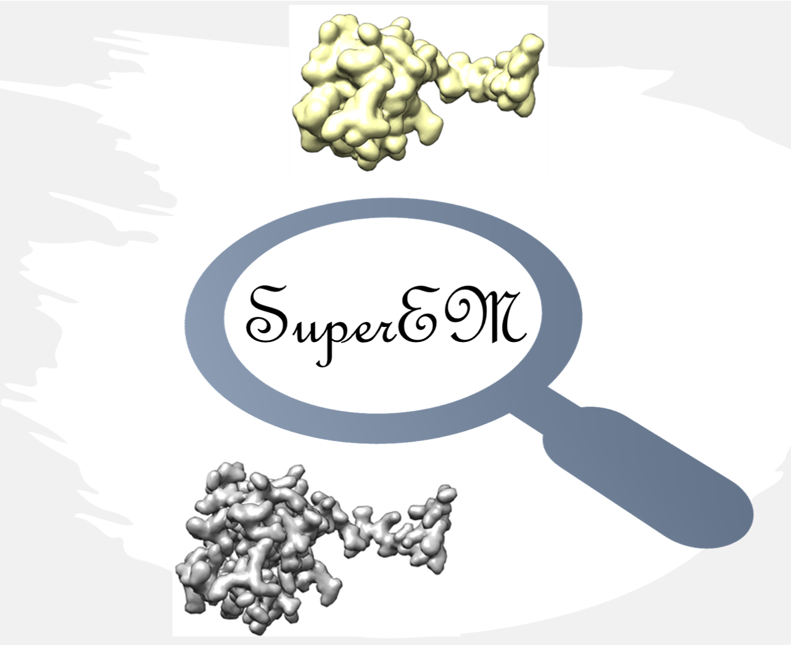

# SuperEM
<p align="center">
  
</p> 
SuperEM is a 3D deep learning based super-resolution method which uses Generative Adversarial Networks (GAN) to improve the resolution of cryo-EM maps in the resolution ranges of 3 Å to 6 Å.  <br>
Copyright (C) 2021 Sai Raghavendra Maddhuri Venkata Subramaniya, Genki Terashi, Daisuke Kihara, and Purdue University.  

License: GPL v3 for academic use. (For commercial use, please contact us for different licensing)  

Contact: Daisuke Kihara (dkihara@purdue.edu)  

Cite : Sai Raghavendra Maddhuri Venkata Subramaniya, Genki Terashi & Daisuke Kihara. Super Resolution Cryo-EM Maps With 3D Deep Generative Networks. In submission (2021).  

## About SuperEM  

Over the past few years, the resolutions of the maps solved by Cryo-Electron Microscopy (Cryo-EM) have largely improved. Although computational protein structure modelling tools perform better as the resolution improves, de novo modelling of the structures still has limitations when the EM map resolution is worse than 4 Å. We report SuperEM, a novel 3D Generative Adversarial Network (GAN) based method to generate super-resolution EM map by taking an experimental EM map as input. SuperEM is designed to work with EM maps in the resolution range of 3 Å to 6 Å and has shown an average resolution improvement of 0.481 Å on a test dataset of 36 experimental maps. In addition, the generated super-resolution maps have also shown to result in better modelling of protein structures with a coverage improvement of 10.2% with MAINMAST and a GDT-TS improvement of 11.5% with phenix further proving the effectiveness of SuperEM in cryo-EM protein modelling.  

GAN architecture of SuperEM is shown below.  

>   
   


## Pre-required software
```

Python 3 : https://www.python.org/downloads/  
pytorch : pip/conda install pytorch   

```
## Instructions  
<meta charset="UTF-8">
<meta name="viewport" content="width=device-width, initial-scale=1">
<link rel="stylesheet" href="data/git/w3.css">  
<link rel="stylesheet" href="https://fonts.googleapis.com/css?family=Lato">
<link rel="stylesheet" href="https://fonts.googleapis.com/css?family=Montserrat">
<link rel="stylesheet" href="https://cdnjs.cloudflare.com/ajax/libs/font-awesome/4.7.0/css/font-awesome.min.css">

<div id="commands" class="w3-row-padding w3-padding-64 w3-container">
  <div class="w3-content">
	<h5> In the following section, we give a step-by-step guide to run various programs for SuperEM.
  </h5>

<div id="datagen" class="w3-row-padding w3-padding-64 w3-container">
<h2>Input file generation</h2>
<h5>
Generate the input file called [your_map_id]_dataset from your map file by following the below 2 steps.
</h5>
<b><h3>1) Trimmap File generation</h3></b>
<pre><p class="w3-code">
<b>data_prep/HLmapData -a [sample_mrc] -b  [sample_mrc] [options] > [output_trimmap_filename]</b><br>
<b>INPUTS:</b><br>
HLmapData_new expects sample_mrc to be a valid filename. Supported file formats are Situs, CCP4, and MRC2000. 
Format is deduced from FILE's extension. 
<br>
<b>OPTIONS:</b><br>
-a [mrc] Input map file of the experimental map.
<br>
-b [mrc] Input map file of the experimental map (Same map as above). If you have a simulated map available and are validating, specify that instead 
<br>
-A [float] The level of isosurface to generate density values for the first map (map specified with option -a). 
You can use the author recommended contour level for experimental EM maps.
<i>default=0.0</i><br>
-B  [float] The level of isosurface to generate density values for the first map (map specified with option -b)
You can use the author recommended contour level for experimental EM maps. If input is simulated map, specify 0.0
<i>default=0.0</i><br>
-w [integer] This option sets the dimensions of sliding cube used for input data generation.
The size of the cube is calculated as <i>2*w+1</i>.
We recommend using a value of 12 for this option that generates input cube of size 25*25*25.
Please be mindful while increasing this option as it increases the portion of an EM map a single cube covers.
Increasing this value also increases running time.  
<i>default=5 (->11x11x11)</i><br>
-s [integer] This option specifies the stride value to be used while generating input cubes
We recommend using a value of 4 for this option. Increasing this value also increases running time.  
<i>default=1 </i><br>
-h, --help, -?, /? Displays the list of above options.<br><br>
<b>USAGE:</b>
./HLmapData_new  -a protein.mrc -b protein.mrc -A <Recommended contour level> -B <Recommended contour level> -w 12 -s 4>  protein_trimmap
      </p></pre>
<br>

<b><h3>2) Input dataset file generation</h3></b>
	<h5>
	This program is used to generate input dataset file from the trimmap file generated in step 1.<br>
	This program is a python script and it works with both python2 and python3. They can be downloaded <a href=https://www.python.org/downloads/ target="_blank">here</a>.<br>
	</h5>
      <pre><p class="w3-code">
<b>python data_prep/dataset_reso.py [sample_trimmap] [<ID>_data] [dataset_folder]</b>
<br>
<b>INPUTS:</b> 
Inputs to this script are trimmap generated in the previous step, ID is a unique identifier of a map such as EMID, and dataset_folder which is a folder to write dataset files. <br><br>
<b>USAGE:</b>
python data_prep/dataset_reso.py protein_trimmap 1_data ./data_dir/
     </p></pre>  
      </div>
  </div>
    <div class="w3-content">
	<div id="superem" class="w3-row-padding w3-padding-64 w3-container">
	<h2>Super Resolution EM map generation</h2>
	<h5>
	Run SuperEM program for generating super-resolution em maps from low-resolution experimental maps.<br>
	Use <b>test.py</b> to generate super-resolution map.<br>
	This program is a python script and it works with both python2 and python3.
	</h5>
      <pre><p class="w3-code">
<b>python test.py --dir_path=INPUT_DATA_DIR --res_blocks=5 --batch_size=128 --in_channels=32 --G_path=GENERATOR_MODEL_PATH --D_path=DISCRIMINATOR_MODEL_PATH</b><br>
<b>INPUT:</b>
  --dir_path            Path to data directory created in the last step  
  --G_path              Specify path of Generator model
  --D_path              Specify path of Discriminator model
<br>
<b>OUTPUT:</b>
This program writes output super-resolution em map cubes to the same directory as input.

<b>USAGE:</b>
python test.py --res_blocks=5 --batch_size=128 --in_channels=32 --G_path=model/G_model --D_path=model/D_model --dir_path=data_dir/
      </p></pre>

<h5>
Finally, run the below two python scripts to merge the SR cubes generated into a final super-resolution map
</h5>
python sr_dataprep.py
      </p></pre>
python avg_model.py
      </p></pre>      
      </div>
  </div>
<h5>
Super-Resolution map is written to Merged.mrc file
</h5>

</div>

## Tutorial: 
<div id="ex2" class="w3-row-padding w3-padding-32 w3-container">
  <div class="w3-content">
   <h1>Experimental map example (EMD-2788)</h1>
    <div class="w3-twothird">

	
<h5>You can download the EM map for protein structure with EMID 2788 : ftp://ftp.ebi.ac.uk/pub/databases/emdb/structures/EMD-2788. Use this map file and follow the instructions in step 1 of usage guide to generate input dataset file.
		The trimmap file is generated as 
	</h5>
	<pre><p class="w3-code">./HLmapData_new  -a 2788.mrc -b 2788.mrc -A  0.16 -B 0.16 -w 12 -s 4>  2788_trimmap</p></pre>
	<h5>The author recommended contour level for the map EMD-2788 is 0.16 which has been provided as one of the options above.
	</h5>
	<h5>You can generate the input dataset file as follows,
	</h5>
	<pre><p class="w3-code">python data_prep/dataset_reso.py 2788_trimmap 2788_data ./data_dir</p></pre>
    </div>
    <div class="w3-third w3-center ">
      <p align="left">Density Map, 2788.mrc</p>
    </div>
  </div>
</div>
<div class="w3-content">
    <div class="w3-twothird">
     <h3>SuperEM super-resolution map generation </h3>
    <h5>
	You can then run the SuperEM program to generate super-resolution EM map as follows
      </h5>

```
python test.py --res_blocks=5 --batch_size=128 --in_channels=32 --G_path=model/G_model --D_path=model/D_model --dir_path=./data_dir/
```
```
python sr_dataprep.py
```
```
python avg_model.py
```
<h5>
Super-Resolution map is written to Merged.mrc file
</h5>
<h5>
	An example of generated super-resolution map of EMD-2788 is shown below.
  </div> 
    <div class="w3-center ">
       <p align="left"> Super-Resolution (SR) Map, 2788_SR.mrc</p>
    </div>  
</div>
<div class="w3-row-padding w3-padding-32 w3-container">
</div>
